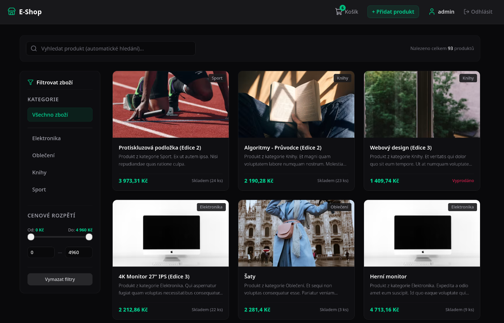

# Event Driven Eshop

This repository contains a highly secure and architecturally clean application that is ready to run.
Backend is written in PHP (Symfony) and it uses a PostgreSQL database.
Frontend is written in React and it uses Tailwind CSS for styles.
Application is fully containerized via Docker.

---
 
## Preview

 *(Main page example)*


---

## Core Architecture & Tech Stack

The system is designed following clean architecture principles, ensuring high performance, strict data consistency, and separation of concerns:

*   **Frontend**: Single Page Application (SPA) built with **React**, **Vite**, and **Tailwind CSS**. State management (authentication state and shopping cart logic) is handled immutably via the React Context API.
*   **Backend**: **Symfony 7** powered by **PHP 8.4 FPM** (FastCGI Process Manager) for high-concurrency request handling.
*   **Database & ORM**: **PostgreSQL 16** managed through **Doctrine ORM**, utilizing the Unit of Work pattern.
*   **Data Integrity (ACID)**: Critical operations such as stock subtraction and bank card balance updates are fully atomic and protected against race conditions (Lost Updates) using database-level **Pessimistic Locking (`PESSIMISTIC_WRITE`)**.
*   **Financial Precision**: All monetary calculations are performed with exact precision using the **BCMath** extension to prevent floating-point rounding errors.
*   **Asynchronous Processing**: Heavy-duty, non-blocking tasks (e.g., invoice generation, simulated email dispatching, ...) are offloaded to background workers using **Symfony Messenger**.
*   **Infrastructure Ready**: The Docker setup includes pre-configured services for **Redis** (caching) and **Apache Kafka** (event streaming) for future horizontal scaling.

---

## Security Features

*   **XSS Protection**: React automatically escapes all dynamic content rendered in JSX, rendering injected scripts completely harmless.
*   **CSRF Protection**: Secure authentication sessions are maintained via HTTP-only cookies enforced with the modern **`SameSite=Lax`** attribute, fully mitigating Cross-Site Request Forgery.
*   **Secure Hashing**: User passwords are encrypted using state-of-the-art native algorithms (Argon2id/bcrypt).

---

## REST API Endpoints

The frontend communicates with the Symfony backend through a structured, status-code-driven REST API. All endpoints return clean JSON payloads:

### Authentication
*   `POST /api/register` – Registers a new user account. Returns HTTP 201 on success.
*   `POST /api/login` – Handled automatically by the Symfony Security Firewall via JSON login.
*   `GET /api/me` – Returns current session data and roles of the authenticated user.
*   `GET /api/logout` – Destroys the server session and instructs the browser to clear the session cookie.

### Product Catalog
*   `GET /api/products` – Server-side paginated grid. Supports full-text search, category filtering, and precise min/max price constraints.
*   `GET /api/products/{id}` – Retrieves full technical and stock details for a single product.
*   `GET /api/products/max-price` – Returns the absolute highest price among all products to dynamically set frontend filter range limits.

### Orders & Payments
*   `POST /api/orders` – Creates a new order in `PENDING` state. Validates stock availability. Requires authentication.
*   `GET /api/orders/history` – Fetches the complete chronological order history for the logged-in user.
*   `POST /api/payment/webhook` – Simulates a secure banking gateway webhook. Atomically locks bank cards and product rows, deducts balances, updates stock, and dispatches the asynchronous event messenger.

---

## Quick Start (Local Development)
You can use the automated `run.sh` script in the root directory of the project.

First, grant execution permissions to the script:
```bash
chmod u+x run.sh
```
After that, you can run the production version of the application by executing: 
```bash 
cd docker
../run.sh prod 
```

--- 

## Start (Local Development)

### 1. Spin up the infrastructure
Run the orchestration command in the directory containing the compose file (`./docker`):
```bash
docker compose up -d --build
```

### 2. Initialize the Backend
Execute the lifecycle commands inside the PHP container environment:
```bash
docker exec -it eshop_backend composer install
docker exec -it eshop_backend php bin/console doctrine:migrations:migrate --no-interaction
docker exec -it eshop_backend php bin/console doctrine:fixtures:load --no-interaction
```

### 3. Start the Background Worker
Launch the asynchronous queue consumer process:
```bash
docker exec -d eshop_backend php bin/console messenger:consume async
```

Open your browser and navigate to `http://localhost` to view the running shop.

---

## Management Command Guide

### Container Management
*   `docker compose ps` – Lists status and mapping of all running services.
*   `docker compose logs -f backend` – Streams real-time error outputs and logs from Symfony.
*   `docker compose down` – Safely stops the orchestration without wiping volumes.

### Symfony & Database Diagnostics
*   `docker exec -it eshop_backend php bin/console cache:clear` – Flushes all application configurations and DI caches.
*   `docker exec -it eshop_backend php bin/console doctrine:schema:validate` – Verifies database mapping alignment between PHP entities and PostgreSQL tables.
